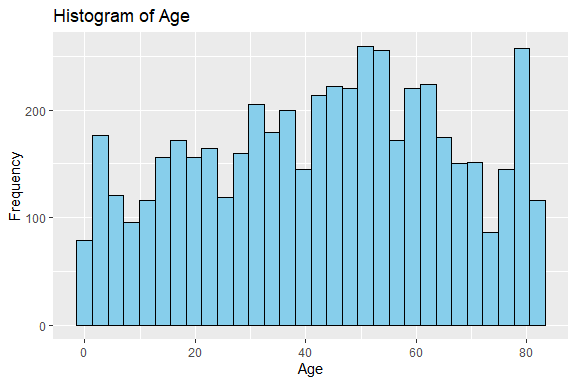
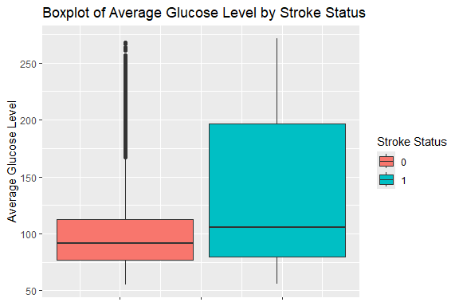
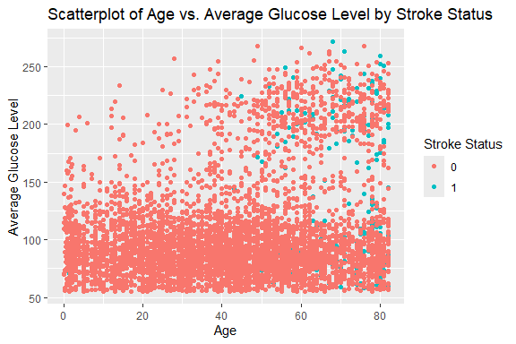
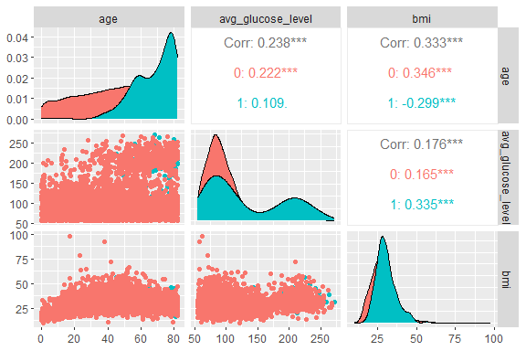

Stroke Prediction
================
Trevor Okinda
2024

- [Student Details](#student-details)
- [Setup Chunk](#setup-chunk)
  - [Source:](#source)
  - [Reference:](#reference)
- [Exploratory Data Analysis](#exploratory-data-analysis)
  - [Load dataset](#load-dataset)
  - [Measures of Frequency](#measures-of-frequency)
  - [Measures of Central Tendency](#measures-of-central-tendency)
  - [Measures of Distribution](#measures-of-distribution)
  - [Measures of Relationship](#measures-of-relationship)
  - [ANOVA](#anova)
  - [Plots](#plots)
- [Preprocessing and Data
  Transformation](#preprocessing-and-data-transformation)
  - [Missing Values](#missing-values)
  - [Imputation](#imputation)

# Student Details

|                       |                   |
|-----------------------|-------------------|
| **Student ID Number** | 134780            |
| **Student Name**      | Trevor Okinda     |
| **BBIT 4.2 Group**    | C                 |
| **Project Name**      | Stroke Prediction |

# Setup Chunk

**Note:** the following KnitR options have been set as the global
defaults: <BR>
`knitr::opts_chunk$set(echo = TRUE, warning = FALSE, eval = TRUE, collapse = FALSE, tidy = TRUE)`.

More KnitR options are documented here
<https://bookdown.org/yihui/rmarkdown-cookbook/chunk-options.html> and
here <https://yihui.org/knitr/options/>.

### Source:

The dataset that was used can be downloaded here: *\<<a
href="https://www.kaggle.com/datasets/fedesoriano/stroke-prediction-dataset\"
class="uri">https://www.kaggle.com/datasets/fedesoriano/stroke-prediction-dataset\</a>\>*

### Reference:

*\<fedesoriano. (2020). Stroke Prediction Dataset. Retrieved from Kaggle
<a
href="https://www.kaggle.com/datasets/fedesoriano/stroke-prediction-dataset\"
class="uri">https://www.kaggle.com/datasets/fedesoriano/stroke-prediction-dataset\</a>\>  
Refer to the APA 7th edition manual for rules on how to cite datasets:
<https://apastyle.apa.org/style-grammar-guidelines/references/examples/data-set-references>*

# Exploratory Data Analysis

## Load dataset

``` r
# Load dataset
stroke_data <- read.csv("stroke_data.csv", colClasses = c(
  gender = "factor",
  age = "numeric",
  hypertension = "factor",
  heart_disease = "factor",
  ever_married = "factor",
  work_type = "factor",
  Residence_type = "factor",
  avg_glucose_level = "numeric",
  bmi = "numeric",
  smoking_status = "factor",
  stroke = "factor"
))

# Display the structure of the dataset
str(stroke_data)
```

    ## 'data.frame':    5110 obs. of  11 variables:
    ##  $ gender           : Factor w/ 3 levels "Female","Male",..: 2 1 2 1 1 2 2 1 1 1 ...
    ##  $ age              : num  67 61 80 49 79 81 74 69 59 78 ...
    ##  $ hypertension     : Factor w/ 2 levels "0","1": 1 1 1 1 2 1 2 1 1 1 ...
    ##  $ heart_disease    : Factor w/ 2 levels "0","1": 2 1 2 1 1 1 2 1 1 1 ...
    ##  $ ever_married     : Factor w/ 2 levels "No","Yes": 2 2 2 2 2 2 2 1 2 2 ...
    ##  $ work_type        : Factor w/ 5 levels "children","Govt_job",..: 4 5 4 4 5 4 4 4 4 4 ...
    ##  $ Residence_type   : Factor w/ 2 levels "Rural","Urban": 2 1 1 2 1 2 1 2 1 2 ...
    ##  $ avg_glucose_level: num  229 202 106 171 174 ...
    ##  $ bmi              : num  36.6 NA 32.5 34.4 24 29 27.4 22.8 NA 24.2 ...
    ##  $ smoking_status   : Factor w/ 4 levels "formerly smoked",..: 1 2 2 3 2 1 2 2 4 4 ...
    ##  $ stroke           : Factor w/ 2 levels "0","1": 2 2 2 2 2 2 2 2 2 2 ...

``` r
# View the first few rows of the dataset
head(stroke_data)
```

    ##   gender age hypertension heart_disease ever_married     work_type
    ## 1   Male  67            0             1          Yes       Private
    ## 2 Female  61            0             0          Yes Self-employed
    ## 3   Male  80            0             1          Yes       Private
    ## 4 Female  49            0             0          Yes       Private
    ## 5 Female  79            1             0          Yes Self-employed
    ## 6   Male  81            0             0          Yes       Private
    ##   Residence_type avg_glucose_level  bmi  smoking_status stroke
    ## 1          Urban            228.69 36.6 formerly smoked      1
    ## 2          Rural            202.21   NA    never smoked      1
    ## 3          Rural            105.92 32.5    never smoked      1
    ## 4          Urban            171.23 34.4          smokes      1
    ## 5          Rural            174.12 24.0    never smoked      1
    ## 6          Urban            186.21 29.0 formerly smoked      1

``` r
# View the dataset in a separate viewer window
View(stroke_data)
```

## Measures of Frequency

``` r
# Measures of Frequency
# Count of stroke events
stroke_count <- table(stroke_data$stroke)
print("Frequency of stroke events:")
```

    ## [1] "Frequency of stroke events:"

``` r
print(stroke_count)
```

    ## 
    ##    0    1 
    ## 4861  249

## Measures of Central Tendency

``` r
# Measures of Central Tendency
# Mean age
mean_age <- mean(stroke_data$age, na.rm = TRUE)
print("Mean age:")
```

    ## [1] "Mean age:"

``` r
print(mean_age)
```

    ## [1] 43.22661

``` r
# Median avg_glucose_level
median_glucose <- median(stroke_data$avg_glucose_level, na.rm = TRUE)
print("Median avg_glucose_level:")
```

    ## [1] "Median avg_glucose_level:"

``` r
print(median_glucose)
```

    ## [1] 91.885

## Measures of Distribution

``` r
# Measures of Distribution
# Standard deviation of BMI
sd_bmi <- sd(stroke_data$bmi, na.rm = TRUE)
print("Standard deviation of BMI:")
```

    ## [1] "Standard deviation of BMI:"

``` r
print(sd_bmi)
```

    ## [1] 7.854067

``` r
# Range of avg_glucose_level
range_glucose <- range(stroke_data$avg_glucose_level, na.rm = TRUE)
print("Range of avg_glucose_level:")
```

    ## [1] "Range of avg_glucose_level:"

``` r
print(range_glucose)
```

    ## [1]  55.12 271.74

## Measures of Relationship

``` r
# Measures of Relationship
# Correlation between age and avg_glucose_level
correlation_age_glucose <- cor(stroke_data$age, stroke_data$avg_glucose_level, use = "complete.obs")
print("Correlation between age and avg_glucose_level:")
```

    ## [1] "Correlation between age and avg_glucose_level:"

``` r
print(correlation_age_glucose)
```

    ## [1] 0.2381711

``` r
# Association between smoking status and stroke using Chi-square test
chi_square_smoking_stroke <- chisq.test(table(stroke_data$smoking_status, stroke_data$stroke))
print("Chi-square test for association between smoking status and stroke:")
```

    ## [1] "Chi-square test for association between smoking status and stroke:"

``` r
print(chi_square_smoking_stroke)
```

    ## 
    ##  Pearson's Chi-squared test
    ## 
    ## data:  table(stroke_data$smoking_status, stroke_data$stroke)
    ## X-squared = 29.147, df = 3, p-value = 2.085e-06

## ANOVA

``` r
# Check the levels of work_type
levels(stroke_data$work_type)
```

    ## [1] "children"      "Govt_job"      "Never_worked"  "Private"      
    ## [5] "Self-employed"

``` r
# Perform ANOVA
anova_result <- aov(avg_glucose_level ~ work_type, data = stroke_data)
print("ANOVA results:")
```

    ## [1] "ANOVA results:"

``` r
print(summary(anova_result))
```

    ##               Df   Sum Sq Mean Sq F value   Pr(>F)    
    ## work_type      4   134615   33654   16.61 1.56e-13 ***
    ## Residuals   5105 10341904    2026                     
    ## ---
    ## Signif. codes:  0 '***' 0.001 '**' 0.01 '*' 0.05 '.' 0.1 ' ' 1

## Plots

``` r
# Load required libraries
library(ggplot2)
library(GGally)
```

    ## Registered S3 method overwritten by 'GGally':
    ##   method from   
    ##   +.gg   ggplot2

``` r
# Univariate Plots
# Histogram of age
ggplot(stroke_data, aes(x = age)) +
  geom_histogram(fill = "skyblue", color = "black", bins = 30) +
  labs(title = "Histogram of Age",
       x = "Age",
       y = "Frequency")
```

<!-- -->

``` r
# Boxplot of avg_glucose_level
ggplot(stroke_data, aes(x = 1, y = avg_glucose_level, fill = stroke)) +
  geom_boxplot() +
  labs(title = "Boxplot of Average Glucose Level by Stroke Status",
       x = NULL,
       y = "Average Glucose Level",
       fill = "Stroke Status") +
  theme(axis.text.x = element_blank())  # Hide x-axis label
```

<!-- -->

``` r
# Multivariate Plot
# Scatterplot of age vs. avg_glucose_level colored by stroke status
ggplot(stroke_data, aes(x = age, y = avg_glucose_level, color = stroke)) +
  geom_point() +
  labs(title = "Scatterplot of Age vs. Average Glucose Level by Stroke Status",
       x = "Age",
       y = "Average Glucose Level",
       color = "Stroke Status")
```

<!-- -->

``` r
# Pairwise scatterplot matrix of numerical variables
num_vars <- c("age", "avg_glucose_level", "bmi")
# Pairwise scatterplot matrix of numerical variables including 'stroke'
ggpairs(stroke_data, columns = num_vars, mapping = aes(color = stroke))
```

<!-- -->

# Preprocessing and Data Transformation

## Missing Values

``` r
# Check for missing values in each column
missing_values <- sapply(stroke_data, function(x) sum(is.na(x)))
print("Missing values in each column:")
```

    ## [1] "Missing values in each column:"

``` r
print(missing_values)
```

    ##            gender               age      hypertension     heart_disease 
    ##                 0                 0                 0                 0 
    ##      ever_married         work_type    Residence_type avg_glucose_level 
    ##                 0                 0                 0                 0 
    ##               bmi    smoking_status            stroke 
    ##               201                 0                 0

``` r
# Total missing values in the dataset
total_missing <- sum(missing_values)
print("Total missing values in the dataset:")
```

    ## [1] "Total missing values in the dataset:"

``` r
print(total_missing)
```

    ## [1] 201

## Imputation

``` r
# Impute missing values in 'bmi' column with mean
mean_bmi <- mean(stroke_data$bmi, na.rm = TRUE)
stroke_data$bmi[is.na(stroke_data$bmi)] <- mean_bmi

# Confirm that missing values have been imputed
missing_values_after_imputation <- sum(is.na(stroke_data$bmi))
print("Missing values in 'bmi' column after imputation:")
```

    ## [1] "Missing values in 'bmi' column after imputation:"

``` r
print(missing_values_after_imputation)
```

    ## [1] 0
